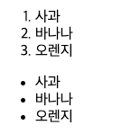
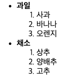
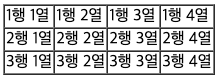
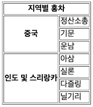
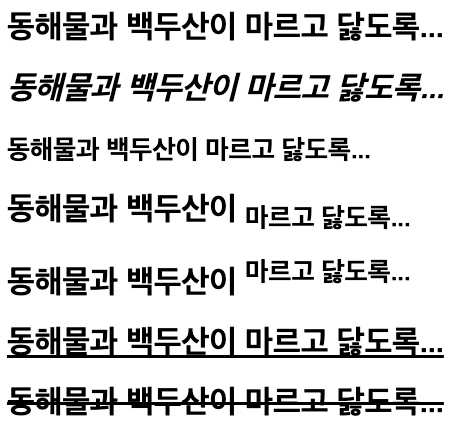

# HTML 교육
## DAY01
### HTML 기본 생성

### list
   -  리스트를 사용할 때는 ol, ul을 사용한다.\
     - ol : 순서가 있는 리스트\
     - ul : 순서가 없는 리스트\
    \
->  윗부분이 ol, 아랫부분이 ul

```html
<ul>
    <!-- 첫번째 목록-->
    <li>
        <b>과일</b>
        <ol>
            <li>사과</li>
            <li>바나나</li>
            <li>오렌지</li>
        </ol>
    </li>
    <!-- 두번째 목록 -->
    <li>
        <b>채소</b>
        <ol>
            <li>상추</li>
            <li>양배추</li>
            <li>고추</li>
        </ol>
    </li>
</ul>
```
\
-> ol 다음에 li를쓰면 리스트 형식으로 번호로 순서가 매겨짐

### TABLE
- 테이블은 표를 만드는 것
- 기본 코드
```html
<body>
    <table border="1" cellspacing="0">
        <tr>
            <td>1행 1열</td>
            <td>1행 2열</td>
            <td>1행 3열</td>
            <td>1행 4열</td>
        </tr>
        <tr>
            <td>2행 1열</td>
            <td>2행 2열</td>
            <td>2행 3열</td>
            <td>2행 4열</td>
        </tr>
        <tr>
            <td>3행 1열</td>
            <td>3행 2열</td>
            <td>3행 3열</td>
            <td>3행 4열</td>
        </tr>
    </table>
</body>
```
- 위코드 처럼 border는 테두리를 만드는 것
- table 태그로 테이블을 만든다.
    tr 태그로 한 행을 구성하고 th 태그로 제목, td 태그로 셀을 작성한다.
- 코드 실행 결과\


### Span 
- 스펜은 테이블에서 표를 병합하는 것을 의미함.
- th는 table header를 의미한다. 일반적으로 테이블의 각 열이나 행의 제목을 나타내며, 브라우저에 따라 기본적으로 굵은 글씨체로 표시됨\
  colspan : 이 속성은 테이블의 한 행에서 여러 개의 열을 합치는 데 사용됩니다.\
  rowspan : 이 속성은 테이블의 한 열에서 여러 개의 행을 합치는 데 사용됩니다.
```html
<table border="1">
    <tr>
        <th colspan="2">지역별 홍차</th>
    </tr>
    <tr>
        <th rowspan="3">중국</th>
        <td>정산소총</td>
    </tr>
    <tr><td>기문</td></tr>
    <tr><td>운남</td></tr>
    <tr>
        <th rowspan="4">인도 및 스리랑카</th>
        <td>아삼</td>
    </tr>
    <tr><td>실론</td></tr>
    <tr><td>다즐링</td></tr>
    <tr><td>닐기리</td></tr>
</table>
```
- 실행결과\


### font
- 폰트는 글자의 기울기, 밑줄 등 폰트에 관련된 것을 의미함.
```html
<body>
        <h1>동해물과 백두산이 마르고 닳도록...</h1>
        <h1><i>동해물과 백두산이 마르고 닳도록...</i></h1>
        <h1><small>동해물과 백두산이 마르고 닳도록...</small></h1>
        <h1>동해물과 백두산이 <sub>마르고 닳도록...</sub></h1>
        <h1>동해물과 백두산이 <sup>마르고 닳도록...</sup></h1>
        <h1><ins>동해물과 백두산이 마르고 닳도록...</ins></h1>
        <h1><del>동해물과 백두산이 마르고 닳도록...</del></h1>
</body>
```
- i : 글자를 살짝 기울이게함.
- small : 글자 크기를 작게함.
- sub : 글자를 조금 아래로 이동시킴
- sup : 글자를 조금 위로 이동시킴
- ins : 글자 밑에 밑줄을 표시함
- del : 글자 중앙에 줄을 그어 표시함
- 실행결과\


### 이미지, 동영상, 오디오
- 이미지를 생성할 때는 img 태그를 사용
```html
<body>
<br>

</body>
</html>
```
- src: source 속성은 위치경로를 나타낸다.\
  href는 사용자의 클릭이 있을때 이동\
  src는 사용자의 클리이 없이 자동으로 출력\
  크기는 width, heih\
  alt는 이미지가 없을 경우 해당하는 문자를 출력함.