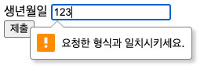
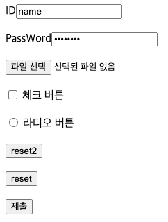
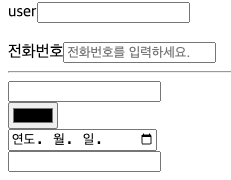
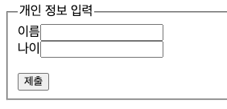
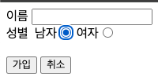
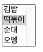
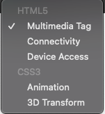

# HTML 교육
## DAY03

### 패턴
```html
<body>
<form>
    생년월일 <input type="text" name="bday" pattern="[0-9]{6}"><br>
    <input  type="submit">
</form>
</body>
```
- pattern속성은 정규표현식을 작성하여 입력의 포맷여부를 확인할 수 있다.\
  input 태그의 입력값 검사에 유효하다.
- [0-9]는 0부터 9까지의 숫자를 의미하고 {6}는 6자리를 나타냅니다.  
따라서 사용자가 이 필드에 숫자 6자리 이외의 값을 입력하면 유효하지 않은 값으로 간주되어 제출되지 않습니다.


### Form
```html
<body>
<!-- 사용자가 입력하는 입력 양식-->
ID<input type="text" name="input" value="name"> <br><br>
PassWord<input type="password" name="pw" value="password"><br><br>
<input type="file" name="file" value="file"><br><br>
<input type="checkbox" name="cb" value="checkbox"> 체크 버튼<br><br>
<input type="radio" name="radio" value="radio"> 라디오 버튼<br><br>
<!-- 보이지 않는 입력 양식-->
<input type="hidden" name="hidden" value="hidden">

<input type="button" value="reset2"><br><br>
<input type="reset" value="reset"><br><br>
<input type="submit" value="제출">
</body>
```
- type이 들어가야 한다.
- name은 필수는 아님. 자주 사용
- value는 입력창에 값을 넣어준다.


- ID,PassWord 등에 name은 value 값에 들어간 값이 들어있어 출력된다.

### Form(Lable)
```html
<body>
<form>
    <label  for="name">
        user<input  type="text" id="name"></label><br><br>
    <label  for="tel">전화번호<input    type="tel"  id="tel"    placeholder="전화번호를 입력하세요."></label>
    <hr>
    <input  type="email"><br>
    <input  type="color"><br>
    <input  type="date"><br>
    <input  type="search"><br>

</form>
</body>
```
-   lable은 입력창에서 user를 클릭해도 입력창에 입력이 가능하게 해준다.
- 입력 양식은 form태그로 먼저 영역을 설정하고 내부에 input 태그를 만든다.
- lable 태그의 for 속성은 레이블을 클릭하면 입력창으로 이동한다.
- placeholder속성은 힌트를 보여준다.



### Form(method)
```html
<form   action="#"  method="get">
    <fieldset>
        <legend>개인 정보 입력</legend>
        이름<input type="text" name="name"><br>
        나이<input  type="test" name="age"><br><br>
        <input  type="submit"   name="submit">
    </fieldset>
</form>
</body>
```
- action 속성에는 폼데이터가 전달된 url을 명시한다.
- action="http://210.119.14.85:8080/form.jsp"
- method속성에는 전송방식을 나타내준다.
- get 방식은 주소 url의 끝에 폼데이터를 실어 보낸다.(간단하지만 보안에 취약하다.)
- legend가 없으면 박스 중간에 글자가 들어가지 않는다.
- get 방식대신 post 방식은 몸체에 폼데이터를 실어 보낸다. (어렵지만 보안에 좋다.)



### Form(radio)
```html
<body>
    <form>
        <label for="username">이름</label>
        <input  type="text" name="username" id="username"><br>
        성별&nbsp;
        <label for="man">남자<input type="radio" name="gender" id="man" value="m">
        </label> <label for="woman">여자<input type="radio" name="gender" id="woman" value="w"></label><br><br>
        <input  type="submit"   value="가입">
        <button>취소</button>
    </form>
</body>
```
- 라이오 버튼 name 속성이 같아야만 여러개 중 한개만 선택된다. 같지 않으면 중복체크가 발생함.



### Form(select)
```html
<body>
<select multiple = "multiple">
  <option>김밥</option>
  <option selected>떡볶이</option>
  <option>순대</option>
  <option>오뎅</option>
</select>
</body>
```
- select 태크안에 option 태그를 사용하여 여러개를 나열한다.
- option 태그에 selected 속성을 사용하면 맨 먼저 노출된다.
- multiple태그는 한번에 모든 선택지를 보여준다.



### Form(selectGroup)
```html
<body>
<select>
  <optgroup label="HTML5">
  <option value="data-1">Multimedia Tag</option>
  <option>Connectivity</option>
  <option>Device Access</option>
  </optgroup>
  <optgroup label="CSS3">
  <option>Animation</option>
  <option>3D Transform</option>
  </optgroup>
</select>
</body>
```
- optgroup태그를 사용해서 옵션을 그룹화한다.

