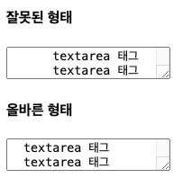
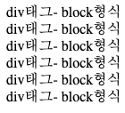
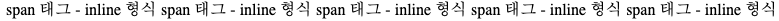

# HTML 교육
## DAY04

### TextArea
```html
<head>
    <meta charset="UTF-8">
    <title>Text area</title>
</head>
<body>
<h4>잘못된 형태</h4>
<textarea>
      textarea 태그
      textarea 태그
</textarea>
<h4>올바른 형태</h4>
<textarea>
  textarea 태그
  textarea 태그
</textarea>
</body>
```


### SpaceBlock
```html
<head>
    <meta charset="UTF-8">
    <title>space block</title>
</head>
<body>
<div> div태그- block형식</div>
<div> div태그- block형식</div>
<div> div태그- block형식</div>
<div> div태그- block형식</div>
<div> div태그- block형식</div>
<div> div태그- block형식</div>
</body>
```

- div태그는 횡으로 블록을 지정한다.

### SpaceInline
```html
<head>
    <meta charset="UTF-8">
    <title>space inline</title>
</head>
<body>
<span> span 태그 - inline 형식</span>
<span> span 태그 - inline 형식</span>
<span> span 태그 - inline 형식</span>
<span> span 태그 - inline 형식</span>
<span> span 태그 - inline 형식</span>
</body>
</html>
```

- 자신의 글자 크기만큼 영역을 차지하면서 왼쪽에서 오른쪽으로 출력된다
- div 태그는 공간을 블록형식으로 분할하고,
- span 태그는 공간을 인라인형식으로 분할한다.

### SpaceRelation
```html
<head>
    <meta charset="UTF-8">
    <title>space relation</title>
</head>
<body>
<div id="wrap">
  <div class="n1">첫번째</div>
  <div class="n2">두번째</div>
</div>
<div class="box1">
  <h1>제목</h1>
  <ul>
    <li>1</li>
    <li>2</li>
    <li>3</li>
    <li>4</li>
  </ul>
</div>
</body>
```
- class는 중복이 가능하다. 그러나 id는 중복하면 안된다.
- id는 고유한 식별자이며, 클래스는 그룹화에 사용되는 것이므로 id는 중복이 되면 안된다.

### OtherDisplay
```html
<head>
    <meta charset="UTF-8">
    <title>other Display</title>
</head>
<body>
<h1>h1 태그</h1>
<p>p 태그</p>
<hr/>
<a href="#">a 태그</a>
<i>i 태그</i>
</body>
```

태그 성질에 따른 분류
1. 블록요소 태그
    1. html, body, div, p, ul, ol, li, dl, dt, dd …
    2. 기본 가로 공간의 크기가 부모태그와 동일하게 인식
    3. 연속해서 작성하면 세로 배열
    4. 공간값이 적용(w, h)

2. 인라인 요소 태그
    1. a. span, strong, i, em…
    2. 기본 가로 공간의 크기가 안쪽에 포함된 내용만큼만 인식(컨텐츠)
    3. 공간값이 적용 안됨

3. 인라인 블록요소 태그
    1. img, input, button…
    2. 기본 가로 공간의 크기가 안쪽에 포함된 내용만큼 인식
    3. 연속해서 작성하면 가로배열
    4. 공간값이 적용된다.

---

---

CSS 선택자

- 전체 선택자: *
- 태그 선택자: 태그
- ID 선택자: #id
- 클래스 선택자: . 클래스
