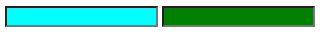
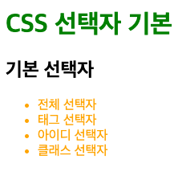
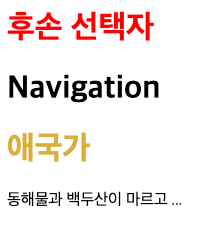
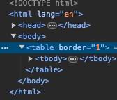
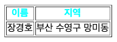
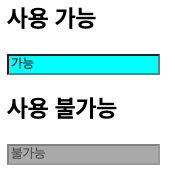
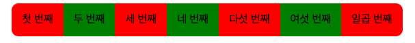

# HTML 교육
## DAY05
- 클래스 속성은 중복될 때
- id는 고유한 식별자
- 입력을 할 때는 form태그를 사용! 서버로 입력받은 내용을 넘겨야 하기 때문에!

### 속성
```html
<head>
    <meta charset="UTF-8">
    <title>attiribute</title>
  <style>
    input[type="text"] {
      background: aqua;
    }
    input[type="password"] {
      background: green;
    }
  </style>
</head>
<body>
<form>
  <input type="text">
  <input type="password">
</form>
</body>
```
- 속성선택자: 대괄호를 사용한다. 선택자[속성=값], input태그의 type속성에 사용

- head부분에 style태크 사용함.

### DESC
```html
<head>
    <meta charset="UTF-8">
    <title>DESC</title>
    <style>
        #header > h1 {
            color: green;
        }
        #section > li{
            color: orange;
        }
    </style>
</head>
<body>
<div id="header">
<h1>CSS 선택자 기본</h1>
<h2>기본 선택자</h2>
<ul id="section">
  <li>전체 선택자</li>
  <li>태그 선택자</li>
  <li>아이디 선택자</li>
  <li>클래스 선택자</li>
</ul>
</div>
</body>
```
- 자식선택자: > 표시로 자식관계를 나타낸다.\

- #을 쓴이유는 id이기때문에 사용함.
```html
<head>
    <meta charset="UTF-8">
    <title>Title</title>
  <style>
    #header > h1{
      color: red;
    }
    #section h1 {
      color: #dbad3b;
    }
  </style>
</head>
<body>
<div id="header">
  <h1 class="title">후손 선택자</h1>
  <div id="nav">
    <h1>Navigation</h1>
  </div>
</div>
<div id="section">
  <h1 class="title">애국가</h1>
  <p>
    동해물과 백두산이 마르고 ...
  </p>
</div>

</body>
```
- header id의 후손인 모든 h1태그에 적용, nav id자식인 h1태그도 적용
- #header h1, h2 {color: red;}
- #header h1, #header h2 {color: red;}\


### DESC Table
```html
<head>
    <meta charset="UTF-8">
    <title>Title</title>
</head>
<style>
  table >tbody > tr > th {
    color: aqua;
  }
</style>
<body>
<table border="1">
  <tr>
    <th>이름</th>
    <th>지역</th>
  </tr>
  <tr>
    <td>장경호</td>
    <td>부산 수영구 망미동</td>
  </tr>
</table>
</body>
</html>
```
- table 태그는 주의해야함
- 개발자 모드에서 확인하면 table 태그에 tbody태그가 자동으로 추가되어 있음.\
따라서 table > tbody > tr > th 순으로 해야함\


### Action
```html
<head>
    <meta charset="UTF-8">
    <title>반응 선택자</title>
    <style>
        h4:hover {
            color: red;
        }
        h4:active {
            color: aqua;
        }
    </style>
</head>
<body>
<h4>반응 선택자</h4>
</body>
```
- 반응선택자: 사용자의 반응으로 hover와 action상태가 만들어 진다.
- 마우스의 커서를 올리는 행위가 hover적용, 클릭하면 action적용.

### State(상태)
```html
<head>
    <meta charset="UTF-8">
    <title>Title</title>
    <style>
        input:enabled {
            background: aqua;
        }
        input:disabled {
            background: darkgray;
        }
    </style>
</head>
<body>
<h2>사용 가능</h2>
<input value="가능">
<h2>사용 불가능</h2>
<input disabled = "disabled" value="불가능">
</body>
```
- 상태 선택자: 입력 양식의 상태를 선택할 때\
  :checked- 체크 상태인 input 태그 선택\
  :focus- 포커스를 맞춘 input\
  :enabled- 사용가능한 input\
  :disabled- 사용불가능한 input\


### Structure
```html
<head>
    <meta charset="UTF-8">
    <title>Title</title>
    <style>
        li {
            list-style: none;
            float: left;
            padding: 15px;
        }
        li:nth-child(2n ) {
            background-color: green;
        }
        li:nth-child(2n+1) {
            background-color: red;
        }
        li:first-child {
            border-radius: 10px 0 0 10px;
        }
        li:last-child {
            border-radius: 0 10px 10px 0;
        }
    </style>
</head>
<body>
<ul>
    <li>첫 번째</li>
    <li>두 번째</li>
    <li>세 번째</li>
    <li>네 번째</li>
    <li>다섯 번째</li>
    <li>여섯 번째</li>
    <li>일곱 번째</li>
</ul>
</body>
```
- 구조선택자: 특정 위치에 있는 태그를 선택할 때 사용\
:nth-child(수열) 형제관계에서 앞에서 수열번째 해당하는 태그 선택\
:first-child 형제관계에서 첫번째로 등장하는 태그 선택\
:last-child 형제관계에서 마지막으로 등장하는 태그 선택\

    list-style은 블릿마커를 제어한다.
    원형블릿마커(disc), 숫자순서(decimal), 비어있는 원(circle)
    사각형(square)
    border-radius 요소의 테두리를 만든다.
    (좌상,우상,우하,좌하), (좌상우하, 우상좌하), (좌상, 우상좌하, 우하좌상)
