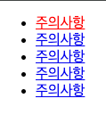
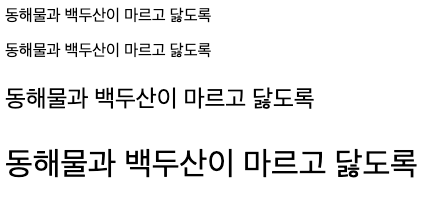
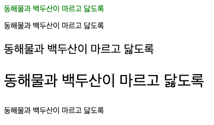
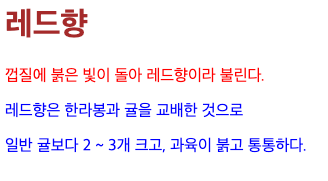

# HTML 교육
## DAY06

### StructFalse
```html
<head>
    <meta charset="UTF-8">
    <title>structFalse</title>
</head>
<style>
    /*li > a:first-child{
        color: red;
    }*/
    li:first-child > a {
        color: red;
    }
</style>
<body>
<ul>
    <li><a href="#">주의사항</a></li>
    <li><a href="#">주의사항</a></li>
    <li><a href="#">주의사항</a></li>
    <li><a href="#">주의사항</a></li>
    <li><a href="#">주의사항</a></li>
</ul>
</body>
```
- '>'를 사용하면 상속의 의미를 가지지만 위치사용 주의 
- li 태그의 자식 a태그
- li 태그의 첫번째 a 태그 자식\


### 사이즈
```html
<head>
    <meta charset="UTF-8">
    <title>Title</title>
    <style>
        /* p:nth-child(1)
        p:nth-child(2){font-size: 100%;}
        p:nth-child(3){font-size: 150%;}
        p:nth-child(4){font-size: 200%;} */
        p:nth-child(2){font-size: 1.0em;} /*1배*/
        p:nth-child(3){font-size: 1.5em;} /*1.5배*/
        p:nth-child(4){font-size: 2.0em;} /*2배*/
    </style>
</head>
<body>
<p>동해물과 백두산이 마르고 닳도록</p>
<p>동해물과 백두산이 마르고 닳도록</p>
<p>동해물과 백두산이 마르고 닳도록</p>
<p>동해물과 백두산이 마르고 닳도록</p>

</body>
```
-  %: 기본으로 설정된 크기를 기준으로 상대적인 크기를 나타낸다
- em : 배수\


### 픽셀사이즈
```html
<head>
    <meta charset="UTF-8">
    <title>Title</title>
    <style>
        p:nth-child(1)
        p:nth-child(2) {
            font-size: 16px;
        }
        p:nth-child(3) {
            font-size: 24px;
        }
        p:nth-child(4) {
            font-size: 32px;
        }
    </style>
</head>
<body>
<p style="color: green">동해물과 백두산이 마르고 닳도록</p>
<p>동해물과 백두산이 마르고 닳도록</p>
<p>동해물과 백두산이 마르고 닳도록</p>
<p>동해물과 백두산이 마르고 닳도록</p>
<p>동해물과 백두산이 마르고 닳도록</p>
</body>
</html>
<!--
    절대길이 단위 1px = 0.265mm
    모니터에 따라 상대적인 크기를 가진
-->
<!--
    CSS 적용 우선 순위
    1. 속성값 뒤에 !important
    (important-black {color: red !important})
    2. style 을 직접 지정한 속성(인라인 속성)
    3. #id로 지정한 속성
    4. 태그로 지정한 속성
    5. 상위 객체에 의해 상속된 속성
-->
```


### 캐스팅
```html
<head>
    <meta charset="UTF-8">
    <title>Title</title>
    <style>
        p {
            color: black;
        }
        p {
            color: blue;
        }
        h1 {
            color: brown !important;
        }
    </style>
</head>
<body>
<h1 style="color: green">레드향</h1>
<p style="color: red">껍질에 붉은 빛이 돌아 레드향이라 불린다.</p>
<p>레드향은 한라봉과 귤을 교배한 것으로</p>
<p>일반 귤보다 2 ~ 3개 크고, 과육이 붉고 통통하다.</p>
</body>
</html>
<!--
    동일하게 적용하는 경우는 마지막의 스타일이 적용된다.
    첫번째 텍스트인 h1요소에는 타입 스타일과 인라인 스타일 모드 사용
    우선 순위가 타입 스타일 정의에 있는 !important이 높아 타입 스타일이 적용됨
    스타일이 중요도와 적용범위가 같은 경우는 나중에 선언된 스타일이 적용된다.(blue 적용)
-->
```


### 박스
```html
<head>
    <meta charset="UTF-8">
    <title>box width height</title>
    <style>
        div {
            width: 100px;
            height: 100px;
            background-color: red;
        }
    </style>
</head>
<body>
<div>

</div>
</body>
```
- div를 만들어서 스타일 태그안에 길이를 설정해서 박스를 만들수 있다.

### Box Margin
```html
<head>
    <meta charset="UTF-8">
    <title>Title</title>
    <style>
        div {
            width: 100px;
            height: 100px;
            background-color: #dbad3b;

            /*margin: 0 30px 0 30px;*/
            /*padding: 0 30px 0 30px;*/
            margin: 0 20px;
            padding: 0 20px;
        }
    </style>
</head>
<body>
<div></div>
</body>
</html>
<!--
    상 - 우 - 하 - 좌
    위아래, 왼오른
-->
```
- margin은 박스를 옮길 수 있다.\
